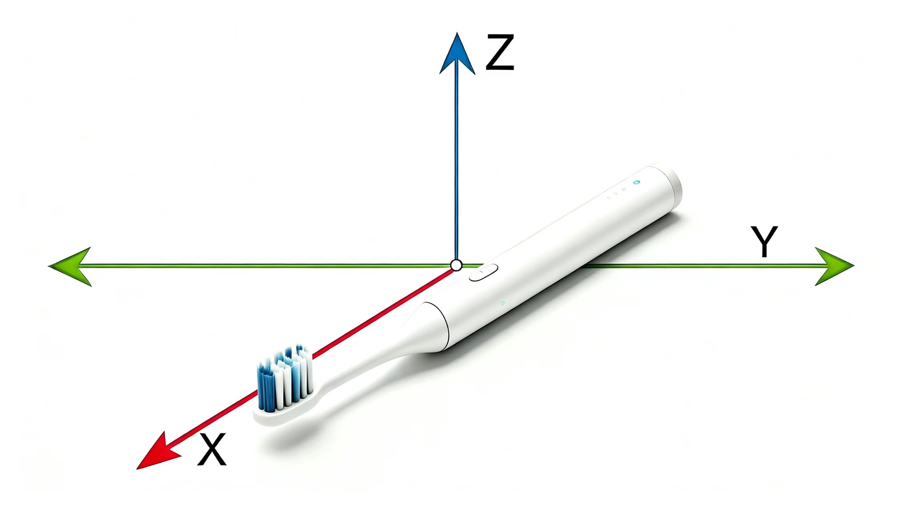
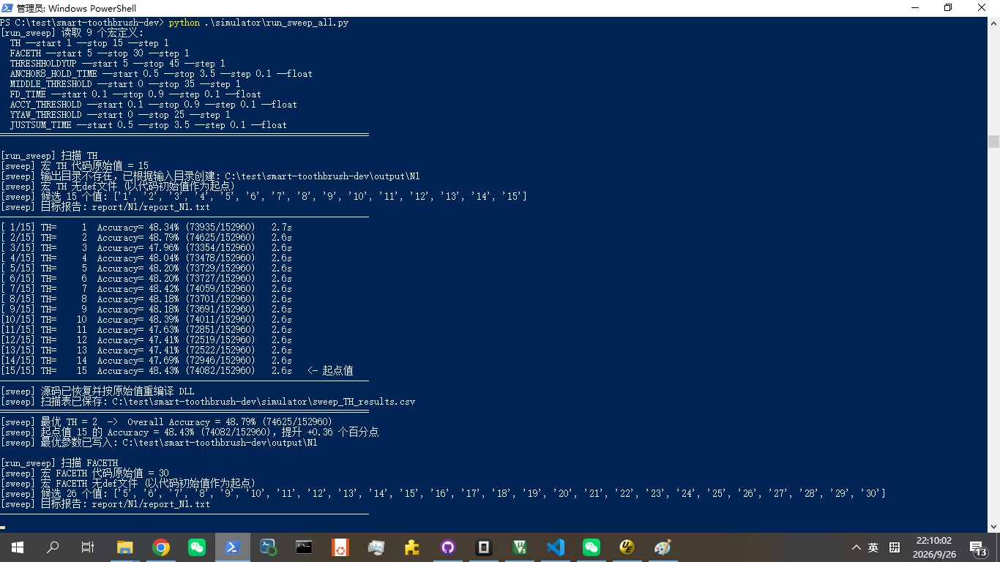
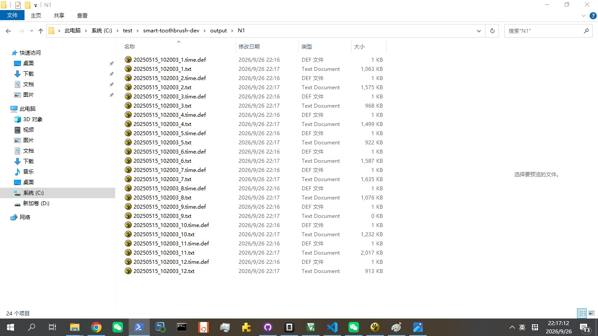
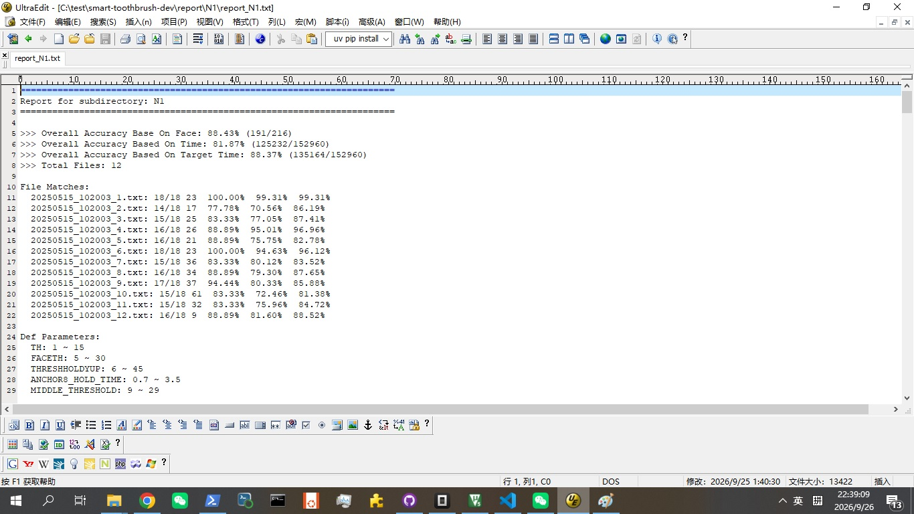
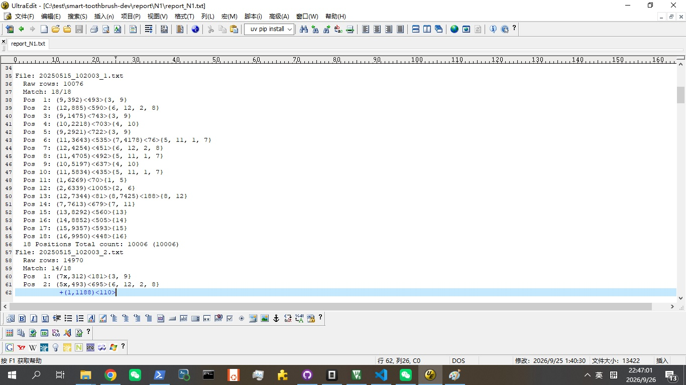
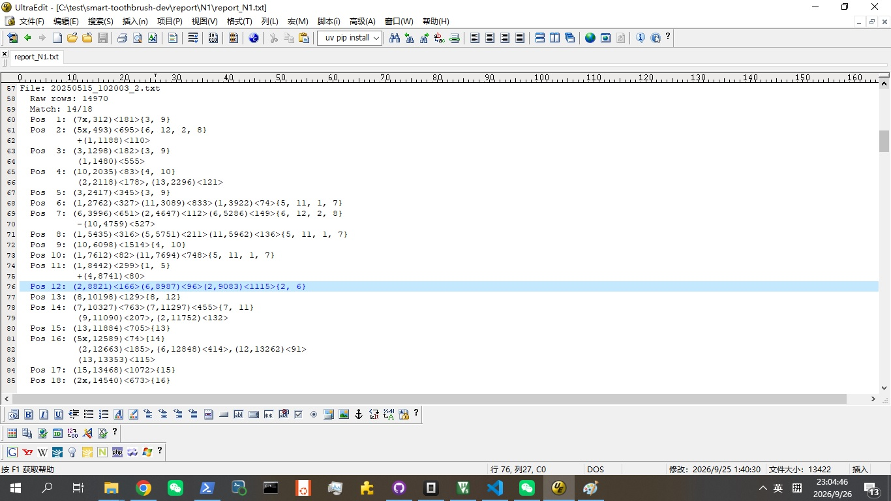

# 6区16面智能牙刷算法

#### 算法介绍
本算法主要特点是结合IMU和Y轴向应力提升智能牙刷算法的牙面识别精度。

##### 坐标定义

右手定则

<br>

<br>
Y轴是牙刷头的侧向轴向。


##### 牙面定义

| 序号 | 牙面 |
| -------- | -------- |
|1| 上左嚼侧|
|2| 上右嚼侧|
|3| 上左外侧|
|4| 上右外侧| 
|5| 上左内侧| 
|6| 上右内侧|           	
|7| 下左嚼侧| 
|8| 下右嚼侧|           	
|9| 下左外侧| 
|10|下右外侧| 
|11|下左内侧|
|12|下右内侧|           	
|13|上中外侧| 
|14|上中内侧| 				
|15|下中外侧| 
|16|下中内侧| 

#### 环境说明

* WIN10 PowerShell
* Python 3.12.7
* GCC 15.2.0

#### 目录结构

* jni目录为算法源代码文件目录
* simulator目录是仿真器和脚本文件目录
* input目录是输入数据文件目录，为12位不同人的刷牙数据
* matlab目录是应力算法等价matlab实现文件目录

#### 文件说明

| 文件 | 说明 |
| -------- | -------- |
|alg_toothbrush.c|智能牙刷算法程序|
|jni/build.bat|overall模式编译批处理|
|jni/build_all.bat|per-fil模式编译批处理|
|build_per_file.py|per-file模式编译脚本|
|Android.mk|for android|
|Application.mk|for android|
|readdata.m|应力算法等价matlab实现程序|
|simulator/build.bat|overall模式编译批处理|
|simulator/build_all.bat|per-file模式编译批处理|
|generate_report.py|输出报告生成脚本|
|run.bat|overall模式运行批处理|
|run_all.bat|per-file模式运行批处理|
|run_sweep_all.py|参数扫描脚本|
|simulator.c|仿真器源代码|
|sweep_define.def|扫描参数定义文件|
|sweep_define.py|单一参数扫描脚本|
|sweep_define-ft.def|门齿扫描参数文件|
|sweep_define-io.def|应力扫描参数文件|
|sweep_define-lr.def|陀螺扫描参数文件|

#### 数据格式

input目录输入数据格式

| 列号 | 变量 | 说明 |
| -------- | -------- | -------- |
|1|VER|保留|
|2|DAT|保留|
|3|DET|开机信号|
|4|R1|保留|
|5|AX|加计X轴LSB|
|6|AY|加计Y轴LSB|          	
|7|AZ|加计Z轴LSB|
|8|GX|陀螺X轴LSB|          	
|9|GY|陀螺Y轴LSB|
|10|GZ|陀螺Z轴LSB|
|11|FX|应力X轴LSB|
|12|FY|应力Y轴LSB|          	
|13|FZ|应力Z轴LSB| 
|14-29|V1-V16|内部调试变量| 				
|30-35|R2-R7|保留| 
|36|T|时间戳|

加计和陀螺的测量范围为16g和2000度/秒。

数据按照如下18个位置顺序采集：
左外->右内->-左外->右外->左外->左内->右内->左内->右外->左内->左上咀嚼面->右上咀嚼面->右下咀嚼面->左下咀嚼面->中上外侧->中上内侧->中下外侧->中下内侧

* 左外包含上左外侧和下左外侧
* 左内包含上左内侧和下左内侧
* 右外包含上右外侧和下右外侧
* 右内包含上右内侧和下右内侧

即以上4个位置不区分上下，另外传感器灵敏度转换在simulator.c里面。

#### 使用说明

主要是根据输入的数据文件，用参数扫描脚本寻找最佳参数。扫描的参数保存在sweep_define.def文件中。可以自行编辑需要扫描的参数及参数范围。参数扫描有2种模式，overall模式和per-file模式，优化目标也有2种，face和time。其中扫描模式在run_sweep_all.py脚本中设置，优化目标在sweep_define.py脚本中设置。

* overall模式 所有数据文件共享同一组参数
* per-file模式 每个数据文件独自优化到最佳参数
* face 优化的首要目标是牙面准确度占比最高，次要目标是时间
* time 优化的首要目标是时间准确度占比最高，次要目标是牙面

参数扫描结束后，参数分别保存在output目录.face.def文件和.time.def文件中。实际工程中，第一步是使用overall模式，即所有数据文件使用同一组参数，因为不论是overall模式还是per-file模式都是基于已知前述刷牙顺序的条件下进行的参数扫描，而实际用户刷牙顺序是未知的，所以原理是，通过大量具有代表性的输入数据文件中扫描一组最佳参数，去测算实际用户未知的刷牙顺序。

#### 使用步骤

1. 设置扫描模式和优化目标
2. python .\simulator\run_sweep_all.py

```
 python .\simulator\run_sweep_all.py
```

<br>

<br>

参数扫描结果保存在def文件中。

<br>

<br>

#### 报告分析

报告分析是以源代码中，V2输出为分析基础，把输出牙面按顺序分配到上述18个位置为目标。

```
V2 = newface;
```

1. .\jni\build_all.bat 每个数据文件的参数单独编译dll文件，保存在dll\all目录
2. .\simulator\build_all.bat 与simulator编译exe文件，保存在simulator\all目录
3. .\simulator\run_all.bat 运行exe，生成输出文件，保存在output目录
4.  python .\simulator\generate_report.py 根据output目录文件，生成报告文件保存在report目录

```
.\jni\build_all.bat
.\simulator\build_all.bat
.\simulator\run_all.bat
 python .\simulator\generate_report.py
```

生成report如下，
<br>

<br>
可以看到overall模式下，以time为优化目标，基于12组刷牙数据，牙面准确率81.02%，时间准确率69.59%，这是优化了3次，即运行3遍run_sweep_all.py脚本的结果。下面是分文件的准确率。

如果我们选择per-file模式，以time为优化目标，优化3次，生成report如下，
<br>

<br>
可以看到此时牙面准确率为88.43%，时间准确率为81.87%，以上都不是最佳参数，因为不是全组合的参数扫描，也可以看到下面分文件准确率，有2位牙面准确率达到100%，时间准确率高达99.31%，另外per-file模式参数扫描时间较长。

#### 报告格式

为方便进行后续优化和deug，报告提供了丰富的信息，
<br>

<br>

<br>

<br>

| 符号 | 说明 |
| -------- | -------- |
|File|文件|
|Raw Rows|总行数|
|Match|牙面击中数|
|Pos|18个位置|
|（）|(实际牙面号，输入数据文件的行数)|
|<>|持续的行数|
|{}|该位置正确的牙面号|
|x|该牙面号错误|
|+|应该属于前一位置|
|-|应该属于后一位置|
|,|2个Pos之间，既不属于前一Pos，也不属于后一Pos|
|Total count|识别正确行数|

#### 源码说明

* imu在输入算法前已经去除offset
* 外部已经实现get_dt()函数

##### define定义

* #define ANCHOR8 启用Y轴应力算法           
* #define SIMSIM 仿真使用，实际使用要注释，使用get_dt()函数   
* #define SUPPORTY 启用陀螺算法

如果项目不包含IMU，有加计和应力，可以注释掉SUPPORTY。

应力部分相关参数
* #define TH                15
* #define FACETH            30
* #define THRESHHOLDYUP     45
* #define ANCHOR8_HOLD_TIME 3.5

门齿相关参数
* #define MIDDLE_THRESHOLD  30
* #define FD_TIME           0.25

陀螺相关参数
* #define ACCY_THRESHOLD    0.3
* #define YYAW_THRESHOLD     6
* #define JUSTSUM_TIME      1.0

debug相关，以下是算法重要的变量，V1-V16可以直接输出到输出文件。

```
void post(void)
{
  V1 = face;//delta_t * 1000;
  V2 = newface;//不能动！！！
  V3 = yaw;
  V4 = lr * 100 + ps * 1; 
  V5 = pitch;
  V6 = roll;
  V7 = yyaw;
  V8 = lastyyaw;
  V9 = anchory8flag1;
  V10 = faceflag3;
  V11 = middle_flag;
  V12 = acc[1] * 10;
  V13 = 0;
  V14 = 0;
  V15 = 0;
  V16 = temp999;	
  temp999 = 0;		
}
```

#### 研发计划

- [x] 门齿的自学习算法
- [ ] 左右牙齿的自学习算法

#### 其他信息

什么地方没说明白，请告知！

#### 样机信息